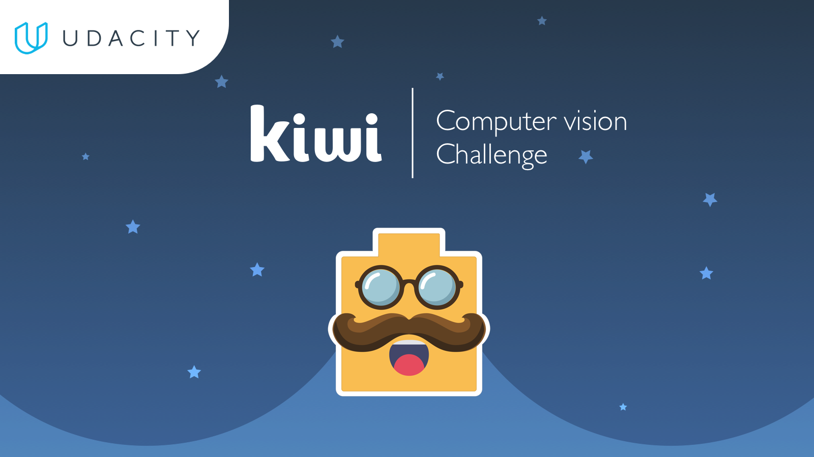
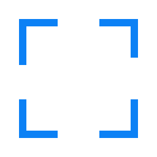
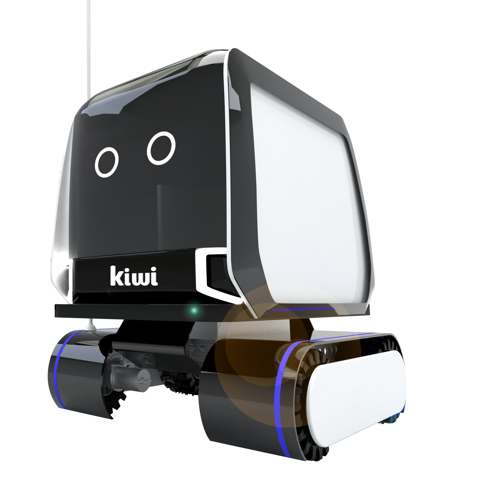

## Welcome to Kiwi's Self-Driving Kiwibot Simulator

This simulator provides students with a real challenge of being a self driving engineer at Kiwi data science division.




### Objectives

Two tracks, easy track and dangerous curves, are provided to you so you can get familiarized with the communications protocols of the game, also you can test any machine learning implementation or computer vision approach which can be helpful on the city challenge

Your main objective is to guide a kiwibot to move autonomously from a food supply point to a delivery point. You are free to choose any method you want, but you are scored on the autopilot mode, and you should be able to provide an environment for us to test.

**Please play with the menu provided in the game, it can give you an overview of all the settings that are customizable**

The graphical targets are:

| | |
|:---:|:---:|
| Pick up Point | Delivery Point |

## Score Calculation

To calculate score we define:
```
`MAXSCORE` = 1000 points
`minDistance` = shortest (optimal) distance between the food supply and the provided delivery point. 
`pilotDistance` = distance traveled while on manual mode 
`robotDistance` = distance traveled while on Autopilot mode
`crashes` = number of crashes in the mission.
```

Some intermediate values:
```
`totalDistance` = robotDistance + pilotDistance

//60 points are deducted per crash. Going into the road will count as a lot of crashes!!
`crashPenalty` = crashes * 60 

// Some points are deducted if total distance is longer than optimal
`distanceFactor` = minDistance / max(minDistance,totalDistance) 

// Severe penalization for driving in manual mode.
`manualFactor` = sqrt(max( 1, pilotDistance));
```

Hence:
```
score = (MAXSCORE * distanceFactor / manualFactor) - crashPenalty;
```
Observe that is not a requirement to do the whole circuit in autopilot, but you are severely penalized for spending any time on manual mode. After one meter driven in manual, the final score reduces drastically. If you drive 9 meters manually, your points will divide by 3. Manual mode should not be used except for the most crucial of circumstances (or training)

### Available Game Builds (compiled builds of the simulator)

Instructions: Download the zip file, extract it and run (see How to Run) the execution file.

Version release: 6/21/17
### [Linux](https://developer.cloud.unity3d.com/share/Wk3YKaV5hM/)

### [Mac](https://developer.cloud.unity3d.com/share/b1boJBSqnM/)

### [Windows](https://developer.cloud.unity3d.com/share/bJbOxBE52G/)

### **Releases on** [Link](https://github.com/Davidnet/kiwix/releases)

### How to run

#### Linux

In [Linux](https://github.com/Davidnet/kiwix/releases/download/v1.1/kiwicampus-kiwibot-simulation-kiwisimulation-linux-1.zip) the zip file contains two [ELF files](https://en.wikipedia.org/wiki/Executable_and_Linkable_Format) that for security reasons are not marked to be executable. To give a file a executable flag the procedure is

```bash
$ chmod a+x file
```
A short summary of `chmod` can be found on the man pages using `man chmod` or on the [web](https://explainshell.com/explain?cmd=chmod+a%2Bx+file).
Be sure to choose the corresponding architecture of your OS.

| File   | Recommended Architecture |
| ----   |:------------------------:|
| x86    | 32 Bit OS                |
| x86-64 | 64 Bit OS                |

After giving the executable bits to the file, recall that for executing the file, use
```bash
$ ./file
```


#### Mac

In [Mac](https://github.com/Davidnet/kiwix/releases/download/v1.1/kiwicampus-kiwibot-simulation-kiwisimulation-mac-1.zip) a single app package is provided, is independent of the architecture. Any problem, please submit a issue report to this repository.

#### Windows

In [Windows](https://github.com/Davidnet/kiwix/releases/download/v1.1/kiwicampus-kiwibot-simulation-kiwisimulation-win64-bit-1.zip) only a 64 bit version is provided, if you are interested on a 32 build, please open an issue on the issue tracker.

### General Recommendations

Is recommendable that if you don't have a GPU available on your system, please run the unity executable on low settings.

### General Controls

A mapping of the keyboard can be found on the settings menu, you can even use any joystick provided you OS can support it.

You can use any joystick supported by your OS, in the keyboard the following controls are provided (standard wasd mapping):

| keyboard   | Action |
| ----   |:------------------------:|
| wasd  | Control motion             |
| Space  | Break                |
| ESC    | Open close main menu |
|  C     | Change camera |
|  R     | Start recording |
|  P     | Begin AutoPilot connection |

### AutoPilot Communication


As you can observe in the communication tab, you can select a port, IP address to send images at a customizable size.

We send the images on a hex string over a socket, the communication sends strings of hex values that needs to be converted to a byteArray object representing the image (see the server.py). Observation: Read until a colon is found. This signals the image size segment.

A server script **which is not a requirement to use** is provided to give you a sketch to work on and give you an overview of how the communication is done **[server.py](server.py)**

Requirements: [Pillow](http://pillow.readthedocs.io/en/4.2.x/)

A requirements.txt is provided.


### Sending commands and receiving commands to the kiwibot:

The program is accepting the following format (example in python provided):

```python
'{ "steering" : "%f", "throttle" : "%f" }' % (steering, throttle)
```

The possible values are on the range:

| Value   | Range |
| ----   |:------------------------:|
| Steering   |  {-1,1}                |
| throttle  | {-1,1}                |

**You can choose the port number on the settings menu. On the next port available you will be receiving a JSON with the following information:**

```JSON
{
  "user": {
    "name": "",
    "email": "c@kiwicampus.com",
    "nickname": "zubcarz",
    "password": "",
    "confirmPassword": ""
  },
  "frames": [
    {
      "time": 5.3613042831421,
      "numberFrame": 0,
      "image": {
        "nameImage": "frame_0_ttl_1_agl_0_mil_5.361304.jpg",
        "path": "D:\/Documents\/Develoment\/Unity\/KiwiBot-Simulation\/KiwiBot-Simulation\/Assets\/Kiwibot-Simulation\/Dataset\/zubcarz-7-28-2017 5-34-12 PM08\/frame_0_ttl_1_agl_0_mil_5.361304.jpg",
        "sizeImage": "Size160X120"
      },
      "sensors": {
        "distanceSensors": [
          1024,
          1024,
          1024
        ],
        "gpsPosition": {
          "x": -2.0697631835938,
          "y": 2.4275255203247
        },
        "compass": {
          "x": 358.68978881836,
          "y": 357.04766845703,
          "z": 0.03589978069067
        }
      },
      "control": {
        "throttle": 0,
        "steering": 0
      }
    },
    {
      "time": 5.4881258010864,
      "numberFrame": 1,
      "image": {
        "nameImage": "frame_1_ttl_1_agl_0_mil_5.488126.jpg",
        "path": "D:\/Documents\/Develoment\/Unity\/KiwiBot-Simulation\/KiwiBot-Simulation\/Assets\/Kiwibot-Simulation\/Dataset\/zubcarz-7-28-2017 5-34-12 PM08\/frame_1_ttl_1_agl_0_mil_5.488126.jpg",
        "sizeImage": "Size160X120"
      },
      "sensors": {
        "distanceSensors": [
          1024,
          1024,
          1024
        ],
        "gpsPosition": {
          "x": -2.0881958007812,
          "y": 2.8051929473877
        },
        "compass": {
          "x": 358.66622924805,
          "y": 357.27294921875,
          "z": 359.94937133789
        }
      },
      "control": {
        "throttle": 0,
        "steering": 0
      }
    }
  ],
}

```

As you can see, at the beginning of communication you will get at the head of the JSON information about you user and registered information, frames information will include information about the image, such as the name and the filepath on which the image was recorded, you will also get sensors information which can help you to navigate around the city.


# Conda Kiwi Enviroment

Conda is a package manager application that quickly installs, runs, and updates packages and their dependencies. Conda is also an environment manager application. A Conda environment is a directory that contains a specific collection of Conda packages


We suggest (not a requirement) to use the following Conda environments so you can start as soon as possible to build your own AutoPilot on python.

## Installation


More information can be obtained at [Anaconda](https://www.continuum.io/downloads)

Be sure to add anaconda/bin to the PATH, either saying yes on the installation menu or adding to your profile file (e.g bash.rc, .profile ... etc).


### Anaconda Usage

We provide to you with Conda environments included with Tensorflow and OpenCV (which can be useful for the hardest level)

### Linux

```
$ conda env create -f kiwix_linux.yml
```
Main packages provided: Tensorflow with GPU support and OpenCV. These environment has also Jupyter (which can be useful for visualization and writing python code), and scipy which can be useful for writing basic models of machine learning algorithms.

### Mac

```
$ conda env create -f kiwix_mac.yml
```
Main packages provided: Tensorflow **without** GPU support, and OpenCV is **not** provided. (Possible options to get OpenCV in Mac is to use [homebrew](https://brew.sh/))

### Windows

Is recommendable for Windows users to use Anaconda and install manually Tensorflow and OpenCV.

### Sourcing environments

To be able to use all the environments provided, conda prepends the path name (e.g kiwienv) onto your system command, to activate and deactivate environments use:

**Linux, OS X**: `source activate snowflakes`

**Windows**: `activate snowflakes`

Deactivate the environment with the following:

**Linux, OS X**: `source deactivate`

**Windows**: `deactivate`

### Recommendations

There are many tools and configurations that can be useful for developing the solution, examples includes:

[Keras](https://keras.io/)

[Caffe](http://caffe.berkeleyvision.org/)

May the force be with you




# Contributors


Project by: [Carlos Zubieta](https://www.linkedin.com/in/carlos-zubieta-52217875/), [Jason Oviedo](https://www.linkedin.com/in/jason-oviedo-46611914/), and [David Cardozo](https://www.linkedin.com/in/davidcardozo/).

Kiwi Campus 2017


# Copyright

 © Kiwi Campus 2017
